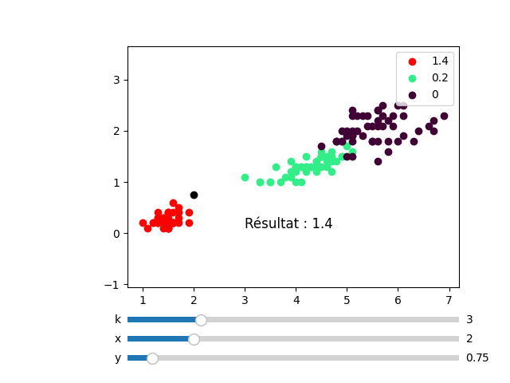

# Algo-knn

Small high-school project to discover the k nearest neighbors algorithm with the iris dataset.

I only changed the project structure to enable installation with pip and thus added slight modifications in [gui.py](src/algo_knn/gui.py) to introduce main function.

## Installation

It is recommended to create a [virtual environment](https://docs.python.org/3/library/venv.html) before installing the package.

```sh
$ pip install git+https://github.com/ookiiwi/algo-knn.git
$ algo-knn # launch program
```

## Gallery
